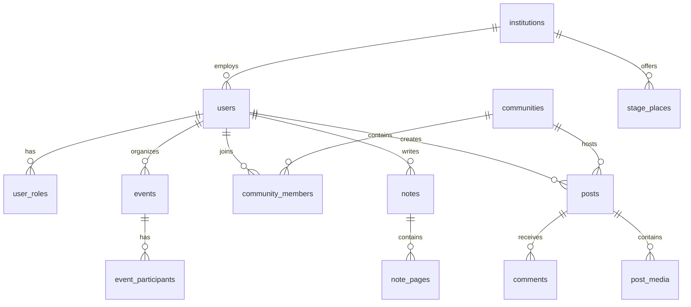

# 🔄 Migration Firebase → Supabase PostgreSQL - Partie 1

## 📋 Vue d'ensemble de la Migration

### Objectifs de la Migration

| Aspect | Firebase Realtime DB | Supabase PostgreSQL |
|--------|---------------------|---------------------|
| **Type** | NoSQL (JSON) | SQL Relationnel |
| **Structure** | Arbre JSON plat | Tables normalisées |
| **Relations** | Références manuelles | Foreign Keys |
| **Requêtes** | Limitées | SQL complet |
| **Performance** | Dépend de la structure | Optimisable avec index |
| **Sécurité** | Rules Firebase | RLS PostgreSQL |
| **Coût** | Par opération | Par stockage/compute |

### Avantages de PostgreSQL

✅ **Relations complexes** avec contraintes d'intégrité  
✅ **Requêtes SQL avancées** (JOIN, agrégations, etc.)  
✅ **Performance optimisable** avec index et vues  
✅ **Transactions ACID** garanties  
✅ **Extensibilité** avec fonctions personnalisées  
✅ **Coût prévisible** et généralement plus économique  

---

## 🔍 Analyse de la Structure Firebase Actuelle

### Collections Principales Identifiées

```
Firebase Realtime Database Structure:
├── Communities/           # Communautés d'utilisateurs
├── Enseignants/          # Profils enseignants
├── Gantts/               # Planifications Gantt
├── Management/           # Données de gestion
├── Hashtags/             # Tags et hashtags
├── Institutions/         # Établissements partenaires
├── Notes/                # Système de notes/carnets
├── Posts/                # Publications sociales
├── Users/                # Profils utilisateurs
├── Votations/            # Système de votes
├── Events/               # Événements et calendrier
└── Messages/             # Messagerie
```

### Analyse Détaillée par Collection

#### 1. **Communities** 
```json
{
  "id": "string",
  "createAd": "date",
  "createdBy": "userId",
  "creatorName": "string",
  "description": "text",
  "managers": { "userId": boolean },
  "members": { "userId": boolean },
  "name": "string",
  "type": "public|private"
}
```

#### 2. **Users/Enseignants**
```json
{
  "id": "string",
  "email": "string",
  "name": "string",
  "role": "student|teacher|admin",
  "institution": "string",
  "profile": { ... },
  "preferences": { ... }
}
```

#### 3. **Institutions**
```json
{
  "id": "string",
  "name": "string",
  "address": "string",
  "coordinates": { "lat": number, "lng": number },
  "type": "hospital|clinic|school",
  "contact": { ... }
}
```

---

## 🏗️ Architecture PostgreSQL Proposée

### Principes de Conception

1. **Normalisation** : Éliminer la redondance des données
2. **Relations explicites** : Foreign keys pour l'intégrité
3. **Performance** : Index stratégiques
4. **Sécurité** : RLS pour l'accès aux données
5. **Évolutivité** : Structure extensible

### Diagramme d'Architecture



---

## 📊 Schéma Principal - Gestion des Utilisateurs

```sql
-- Table principale des utilisateurs
CREATE TABLE users (
    id UUID PRIMARY KEY DEFAULT gen_random_uuid(),
    auth_id UUID UNIQUE NOT NULL, -- Lien avec Supabase Auth
    email VARCHAR(255) UNIQUE NOT NULL,
    first_name VARCHAR(100) NOT NULL,
    last_name VARCHAR(100) NOT NULL,
    display_name VARCHAR(200),
    avatar_url TEXT,
    phone VARCHAR(20),
    date_of_birth DATE,
    institution_id UUID REFERENCES institutions(id),
    student_number VARCHAR(50),
    year_of_study INTEGER,
    specialization VARCHAR(100),
    bio TEXT,
    is_active BOOLEAN DEFAULT true,
    email_verified BOOLEAN DEFAULT false,
    last_login_at TIMESTAMPTZ,
    created_at TIMESTAMPTZ DEFAULT NOW(),
    updated_at TIMESTAMPTZ DEFAULT NOW()
);

-- Système de rôles flexible
CREATE TABLE roles (
    id UUID PRIMARY KEY DEFAULT gen_random_uuid(),
    name VARCHAR(50) UNIQUE NOT NULL,
    description TEXT,
    permissions JSONB DEFAULT '{}',
    created_at TIMESTAMPTZ DEFAULT NOW()
);

-- Association utilisateurs-rôles (many-to-many)
CREATE TABLE user_roles (
    id UUID PRIMARY KEY DEFAULT gen_random_uuid(),
    user_id UUID NOT NULL REFERENCES users(id) ON DELETE CASCADE,
    role_id UUID NOT NULL REFERENCES roles(id) ON DELETE CASCADE,
    granted_by UUID REFERENCES users(id),
    granted_at TIMESTAMPTZ DEFAULT NOW(),
    expires_at TIMESTAMPTZ,
    UNIQUE(user_id, role_id)
);

-- Profils spécialisés pour étudiants
CREATE TABLE students (
    id UUID PRIMARY KEY DEFAULT gen_random_uuid(),
    user_id UUID UNIQUE NOT NULL REFERENCES users(id) ON DELETE CASCADE,
    student_number VARCHAR(50) UNIQUE NOT NULL,
    year_of_study INTEGER NOT NULL CHECK (year_of_study BETWEEN 1 AND 6),
    specialization VARCHAR(100),
    academic_year VARCHAR(20), -- Ex: "2024-2025"
    mentor_id UUID REFERENCES teachers(id),
    status VARCHAR(20) DEFAULT 'active' CHECK (status IN ('active', 'suspended', 'graduated', 'dropped')),
    created_at TIMESTAMPTZ DEFAULT NOW(),
    updated_at TIMESTAMPTZ DEFAULT NOW()
);

-- Profils spécialisés pour enseignants
CREATE TABLE teachers (
    id UUID PRIMARY KEY DEFAULT gen_random_uuid(),
    user_id UUID UNIQUE NOT NULL REFERENCES users(id) ON DELETE CASCADE,
    employee_number VARCHAR(50) UNIQUE,
    department VARCHAR(100),
    title VARCHAR(100), -- Prof, Dr, etc.
    office_location VARCHAR(100),
    office_hours TEXT,
    research_interests TEXT[],
    publications_count INTEGER DEFAULT 0,
    hire_date DATE,
    status VARCHAR(20) DEFAULT 'active' CHECK (status IN ('active', 'sabbatical', 'retired', 'inactive')),
    created_at TIMESTAMPTZ DEFAULT NOW(),
    updated_at TIMESTAMPTZ DEFAULT NOW()
);

-- Profils pour praticiens/superviseurs de stage
CREATE TABLE practitioners (
    id UUID PRIMARY KEY DEFAULT gen_random_uuid(),
    user_id UUID UNIQUE NOT NULL REFERENCES users(id) ON DELETE CASCADE,
    license_number VARCHAR(100),
    specializations TEXT[],
    years_of_experience INTEGER,
    institution_id UUID REFERENCES institutions(id),
    supervisor_level VARCHAR(20) CHECK (supervisor_level IN ('junior', 'senior', 'expert')),
    max_students_supervised INTEGER DEFAULT 3,
    current_students_count INTEGER DEFAULT 0,
    availability_status VARCHAR(20) DEFAULT 'available' CHECK (availability_status IN ('available', 'busy', 'unavailable')),
    created_at TIMESTAMPTZ DEFAULT NOW(),
    updated_at TIMESTAMPTZ DEFAULT NOW()
);
```

---

## 🏥 Schéma Institutions et Stages

```sql
-- Institutions partenaires
CREATE TABLE institutions (
    id UUID PRIMARY KEY DEFAULT gen_random_uuid(),
    name VARCHAR(200) NOT NULL,
    short_name VARCHAR(50),
    type VARCHAR(50) NOT NULL CHECK (type IN ('hospital', 'clinic', 'rehabilitation_center', 'private_practice', 'school', 'university')),
    address TEXT NOT NULL,
    city VARCHAR(100) NOT NULL,
    postal_code VARCHAR(20),
    country VARCHAR(100) DEFAULT 'Switzerland',
    latitude DECIMAL(10, 8),
    longitude DECIMAL(11, 8),
    phone VARCHAR(20),
    email VARCHAR(255),
    website TEXT,
    contact_person VARCHAR(200),
    contact_email VARCHAR(255),
    contact_phone VARCHAR(20),
    description TEXT,
    logo_url TEXT,
    is_active BOOLEAN DEFAULT true,
    partnership_start_date DATE,
    partnership_end_date DATE,
    accreditation_info JSONB DEFAULT '{}',
    facilities JSONB DEFAULT '{}', -- Équipements disponibles
    specializations TEXT[],
    capacity_info JSONB DEFAULT '{}',
    created_at TIMESTAMPTZ DEFAULT NOW(),
    updated_at TIMESTAMPTZ DEFAULT NOW()
);

-- Places de stage disponibles
CREATE TABLE stage_places (
    id UUID PRIMARY KEY DEFAULT gen_random_uuid(),
    institution_id UUID NOT NULL REFERENCES institutions(id) ON DELETE CASCADE,
    title VARCHAR(200) NOT NULL,
    description TEXT,
    specialization VARCHAR(100) NOT NULL,
    level VARCHAR(20) NOT NULL CHECK (level IN ('bachelor_1', 'bachelor_2', 'bachelor_3', 'master_1', 'master_2')),
    duration_weeks INTEGER NOT NULL,
    start_date DATE NOT NULL,
    end_date DATE NOT NULL,
    max_students INTEGER DEFAULT 1,
    current_students INTEGER DEFAULT 0,
    supervisor_id UUID REFERENCES practitioners(id),
    requirements TEXT[],
    learning_objectives TEXT[],
    evaluation_criteria TEXT[],
    location_details TEXT,
    schedule_info TEXT,
    transportation_info TEXT,
    accommodation_info TEXT,
    compensation_amount DECIMAL(10, 2),
    compensation_currency VARCHAR(3) DEFAULT 'CHF',
    status VARCHAR(20) DEFAULT 'available' CHECK (status IN ('available', 'full', 'cancelled', 'completed')),
    application_deadline DATE,
    selection_criteria TEXT,
    contact_instructions TEXT,
    created_by UUID REFERENCES users(id),
    created_at TIMESTAMPTZ DEFAULT NOW(),
    updated_at TIMESTAMPTZ DEFAULT NOW()
);

-- Candidatures pour les stages
CREATE TABLE stage_applications (
    id UUID PRIMARY KEY DEFAULT gen_random_uuid(),
    stage_place_id UUID NOT NULL REFERENCES stage_places(id) ON DELETE CASCADE,
    student_id UUID NOT NULL REFERENCES students(id) ON DELETE CASCADE,
    status VARCHAR(20) DEFAULT 'pending' CHECK (status IN ('pending', 'accepted', 'rejected', 'withdrawn', 'waitlisted')),
    motivation_letter TEXT,
    cv_url TEXT,
    additional_documents JSONB DEFAULT '[]',
    application_date TIMESTAMPTZ DEFAULT NOW(),
    review_date TIMESTAMPTZ,
    reviewer_id UUID REFERENCES users(id),
    reviewer_notes TEXT,
    interview_scheduled_at TIMESTAMPTZ,
    interview_notes TEXT,
    decision_reason TEXT,
    priority_ranking INTEGER,
    created_at TIMESTAMPTZ DEFAULT NOW(),
    updated_at TIMESTAMPTZ DEFAULT NOW(),
    UNIQUE(stage_place_id, student_id)
);
```

---

## 🔄 Mappings Firebase → PostgreSQL

### Table de Correspondance

| Firebase Collection | PostgreSQL Table(s) | Notes |
|-------------------|-------------------|-------|
| `Communities/` | `communities`, `community_members` | Séparation des membres |
| `Users/` | `users`, `students`, `teachers`, `practitioners` | Profils spécialisés |
| `Enseignants/` | `teachers` | Intégré dans le système utilisateurs |
| `Institutions/` | `institutions`, `stage_places` | Places de stage séparées |
| `Posts/` | `posts`, `post_media`, `comments` | Médias et commentaires séparés |
| `Notes/` | `notebooks`, `note_pages` | Structure hiérarchique |
| `Events/` | `events`, `event_participants` | Participants séparés |
| `Votations/` | `votations`, `votation_options`, `votes` | Structure normalisée |
| `Messages/` | `conversations`, `messages` | Conversations groupées |
| `Hashtags/` | `hashtags` | Table dédiée avec statistiques |

**Suite dans PARTIE 2** : Schémas complets pour Social, Notes, Événements, Votations, Messagerie et Gamification.
