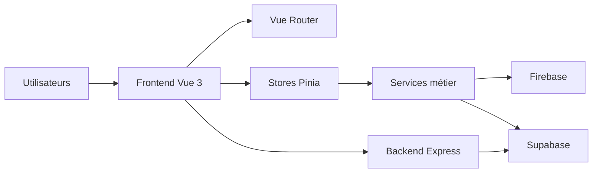

  

    
Vue d'ensemble

    <h2 class="docs-section-head__title">Les trois couches à garder en tête</h2>
  

  

    Toute reprise du projet doit relier l'interface, la logique métier et la vraie source de données.
  

  
◆Frontend Vue 3

  
◆Services métier & stores

  
◆Firebase, Supabase, backend

## Résumé

Le projet est une application Vue 3 qui agrège plusieurs domaines métier et utilise :

- Firebase pour une partie legacy
- Supabase comme cible principale
- un backend Node/Express pour certaines API et intégrations

## Schéma

## Fichiers structurants

- `src/main.js`
- `src/router.js`
- `src/firebase.js`
- `src/supabase.js`
- `backend/index.js`
- `supabase/migrations/`
