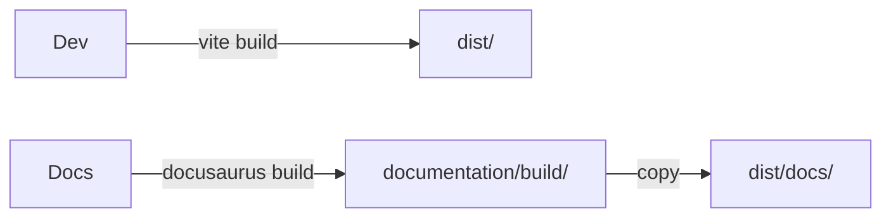

## Frontend

- Framework: Vue 3 + Vite
- UI: PrimeVue, PrimeFlex, PrimeIcons
- State: Pinia
- Routing: Vue Router
- PWA: vite-plugin-pwa

## Backends

- Firebase: Auth, Realtime Database, Storage, Hosting
- Supabase: Auth, Postgres, Storage, RLS, Realtime

## Organisation du code

- `src/components/` composants réutilisables (Dashboard, Social, Institutions, etc.)
- `src/views/` pages structurées par domaines (auth, admin, apps, social, institutions, etc.)
- `src/service/` services (Firebase, Supabase, médias, gamification)
- `supabase_migrations/` schéma SQL et migrations

## Flux de build

1. Build app Vite → `dist/`
2. Build docs Docusaurus → `documentation/build/`
3. Copie des docs → `dist/docs/`

## Schéma simplifié

