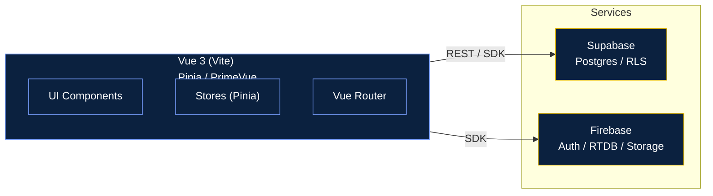
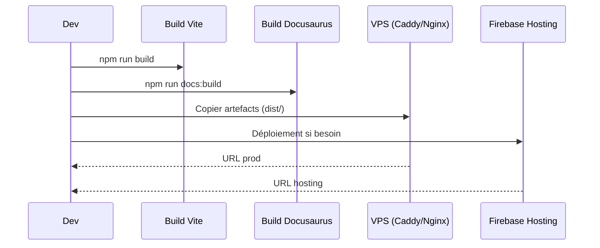
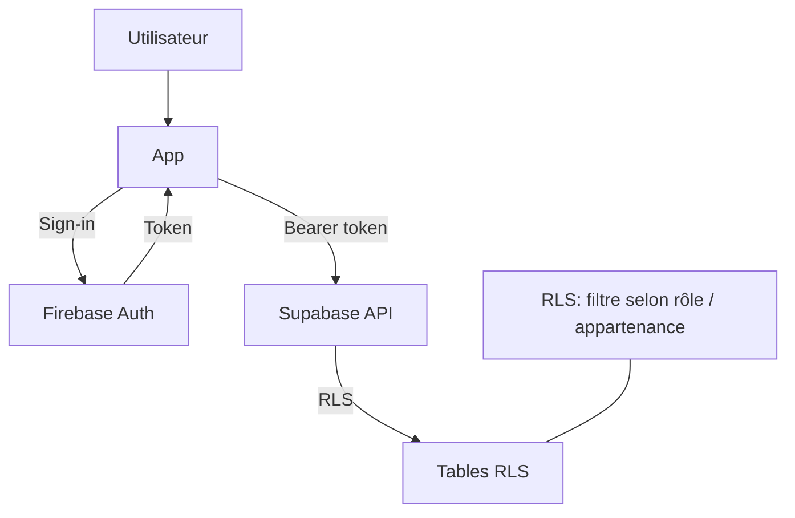
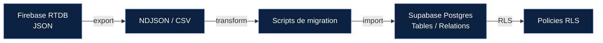

Cette page présente des schémas Mermaid illustrant l’architecture globale et les flux clés (Frontend, Backends, Déploiement, Sécurité).

## Vue d’ensemble — Modules principaux

## Flux déploiement (dev → prod)

## Authentification & Rôles (vue d’ensemble)

## Notes

- L’app peut consommer à la fois Supabase (Postgres + RLS) et Firebase (Auth / RTDB / Storage) selon les besoins.
- Déploiement: selon les cibles, via VPS (Caddy/Nginx) et/ou Firebase Hosting.
- Sécurité: côté Supabase, privilégier RLS; côté Firebase, utiliser les règles RTDB / Storage.

## Données & migrations (Firebase → Supabase)

