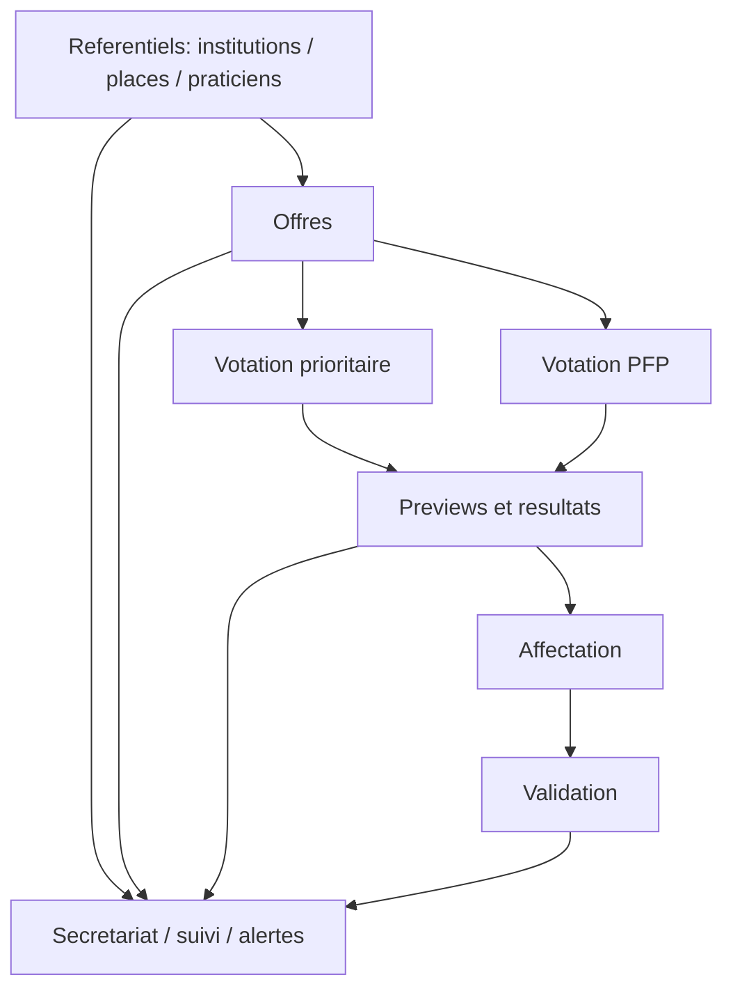

## Objectif

Documenter les grands flux PFP pour pouvoir reprendre le domaine sans se limiter a une liste de fichiers.

## Flux 1 - gestion structurelle des referentiels

Ce flux concerne:

- institutions
- places
- praticiens formateurs
- etudiants

Points d'entree typiques:

- vues `admin/formation-pratique/*`
- stores `placesStore`, `praticiensStore`, `repondantPhysioHESStore`

Finalité :

- maintenir le referentiel utilise par les campagnes PFP

## Flux 2 - preparation des offres

Ce flux concerne:

- offres de places
- suivi institutions
- recapitulatifs
- secretariat

Vues typiques:

- `ManagementOffreView.vue`
- `SuiviInstitutions.vue`
- `SuiviOffresInstitutions.vue`
- `TableauRecapitulatifOffres.vue`

Risque:

- toucher aux offres sans verifier les consequences sur la votation et les affectations

## Flux 3 - votation prioritaire

Ce flux concerne:

- collecte ou lecture des priorites
- vues de resultat
- cas specifiques ou particuliers

Vues typiques:

- `ManagementVotationPrioritaireView.vue`
- `VotationPrioritaireViewPHYFP.vue`
- `ResultPreviewVotationView.vue`

## Flux 4 - votation PFP

Ce flux concerne:

- campagne principale
- etudiants
- resultats
- preview

Vues typiques:

- `VotationEtudiantsView.vue`
- `VotationPFPViewPHYFP.vue`
- `ResultPreviewVotationView.vue`

## Flux 5 - affectation et validation

Ce flux concerne:

- places assignees
- validation des places
- validation PFP
- cohort stats

Vues typiques:

- `PlacesAssignedView.vue`
- `PlacesAssignmentView.vue`
- `ValidationPFP.vue`
- `PfpCohortStatsView.vue`

## Flux 6 - secretariat et supervision

Ce flux concerne:

- verification des criteres
- suivi cas particuliers
- alertes
- vues d'ensemble
- recap notes / CPT

Vues typiques:

- `VerificationCriteresEtudiants.vue`
- `SuiviCasParticuliers.vue`
- `AlertesDashboard.vue`
- `VueDEnsembleFP.vue`
- `RecapPFPNotes.vue`
- `RecapCPTEvaluation.vue`

## Schema simplifie

## Regle de maintenance

Ne jamais traiter un ecran PFP comme isole. Il faut toujours se demander a quel flux il appartient, ce qui vient avant et ce que cela impacte apres.
