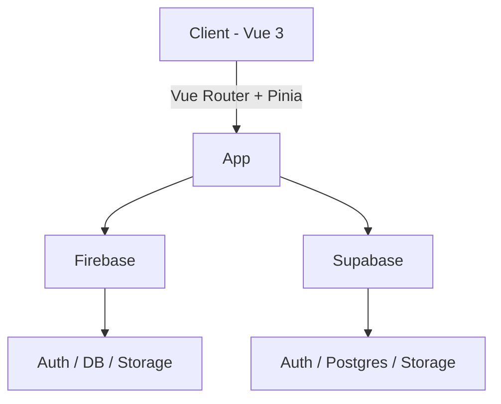

Bienvenue dans la documentation technique de la Plateforme HEdS.

Cette documentation couvre:

- Architecture générale (frontend Vue 3 + Vite, Firebase/Supabase, services)
- Administration (utilisateurs, institutions, places, votations)
- Applications intégrées (chat, mail, notes, calendrier, files, events, tools)
- Gamification (maisons, défis, quêtes, badges, analytics)
- Déploiement et variables d'environnement

