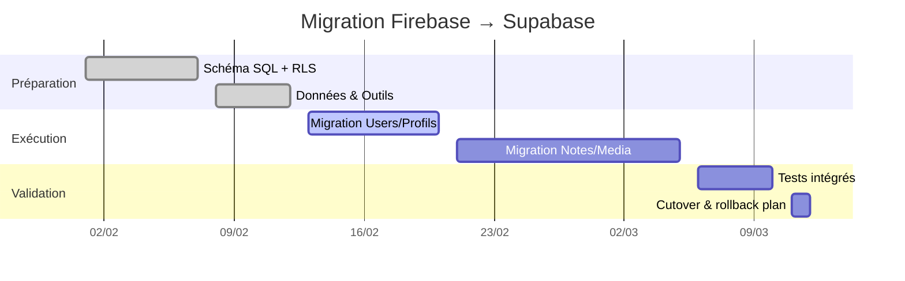

Suivi des chantiers de migration et cutovers.

```mermaid
gantt
  title Migration Firebase → Supabase
  dateFormat  YYYY-MM-DD
  axisFormat  %d/%m
  section Préparation
  Schéma SQL + RLS      :done, m1, 2025-02-01, 2025-02-07
  Données & Outils      :done, m2, 2025-02-08, 2025-02-12
  section Exécution
  Migration Users/Profils :active, m3, 2025-02-13, 2025-02-20
  Migration Notes/Media   :       m4, 2025-02-21, 2025-03-05
  section Validation
  Tests intégrés          :       m5, 2025-03-06, 2025-03-10
  Cutover & rollback plan :       m6, 2025-03-11, 2025-03-12
```

Checklist:
- Variables d’environnement OK
- Scripts d’export/import validés
- Rollback plan testé
- Monitoring post-cutover
