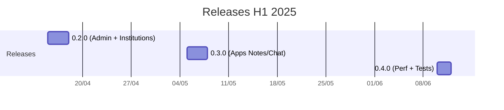

Les releases structurent les livraisons et les notes de version.

## Calendrier (exemple)

## Notes de version (template)

- Version: x.y.z — Date: AAAA-MM-JJ
- Nouvelles fonctionnalités:
- Corrections:
- Migrations:
- Connu:

## Branching (suggestion)

- main (stable) / develop (intégration)
- feature/*, bugfix/*, hotfix/*
