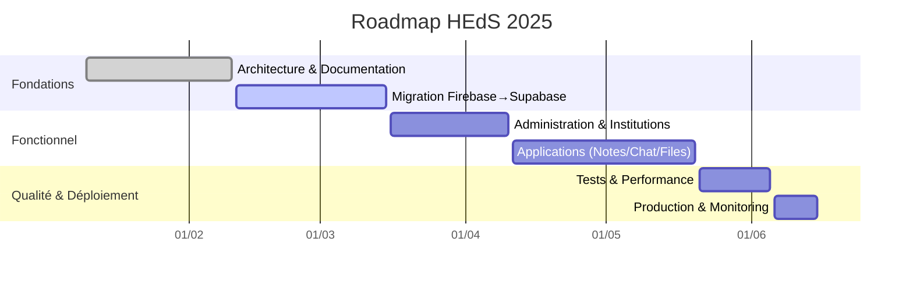

La roadmap fournit une vue macro des jalons fonctionnels et techniques.

```mermaid
gantt
  title Roadmap HEdS 2025
  dateFormat  YYYY-MM-DD
  axisFormat  %d/%m
  section Fondations
  Architecture & Documentation       :done,    F1, 2025-01-10, 2025-02-10
  Migration Firebase→Supabase        :active,  F2, 2025-02-11, 2025-03-15
  section Fonctionnel
  Administration & Institutions      :        F3, 2025-03-16, 2025-04-10
  Applications (Notes/Chat/Files)    :        F4, 2025-04-11, 2025-05-20
  section Qualité & Déploiement
  Tests & Performance                :        Q1, 2025-05-21, 2025-06-05
  Production & Monitoring            :        Q2, 2025-06-06, 2025-06-15
```

Notes:
- Les dates sont indicatives et servent de guide.
- Ajuster régulièrement selon l’avancement réel.
