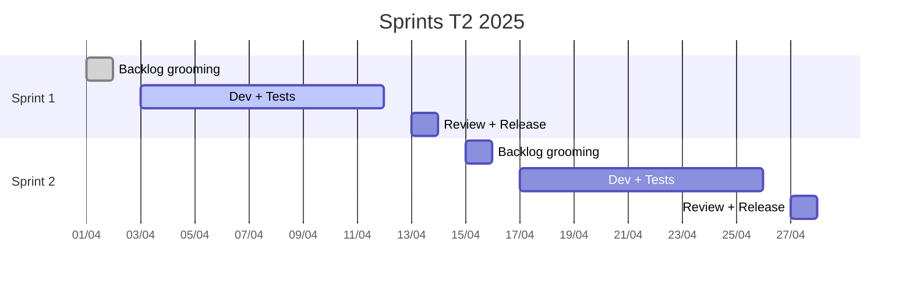

Cadence recommandée: sprints de 2 semaines.

```mermaid
gantt
  title Sprints T2 2025
  dateFormat  YYYY-MM-DD
  axisFormat  %d/%m
  section Sprint 1
  Backlog grooming   :done, s1a, 2025-04-01, 2025-04-02
  Dev + Tests        :active, s1b, 2025-04-03, 2025-04-12
  Review + Release   :       s1c, 2025-04-13, 2025-04-14
  section Sprint 2
  Backlog grooming   :       s2a, 2025-04-15, 2025-04-16
  Dev + Tests        :       s2b, 2025-04-17, 2025-04-26
  Review + Release   :       s2c, 2025-04-27, 2025-04-28
```

Bonnes pratiques:
- Alignement hebdo (30 min)
- Démo sprint (courte, orientée valeur)
- Rétrospective (points d’amélioration actionnables)
