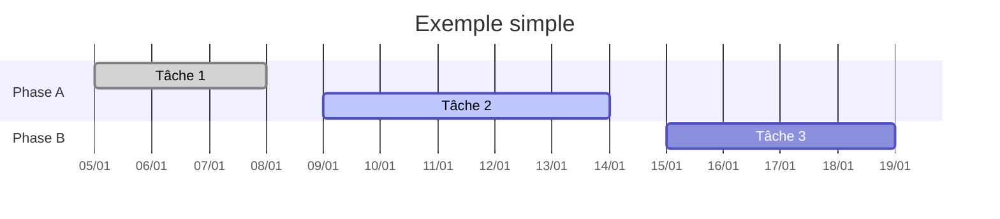
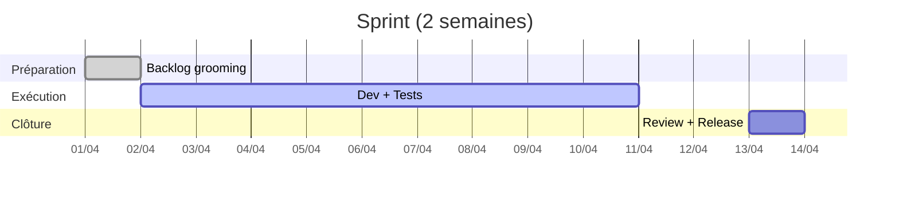
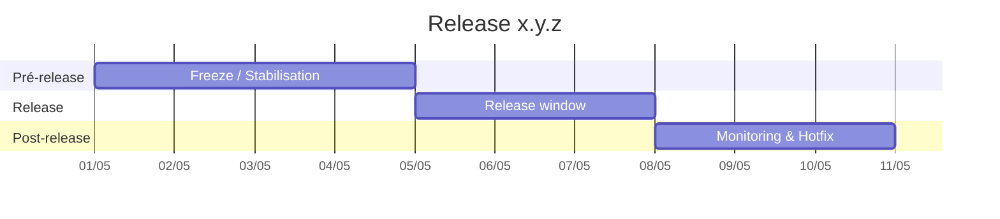
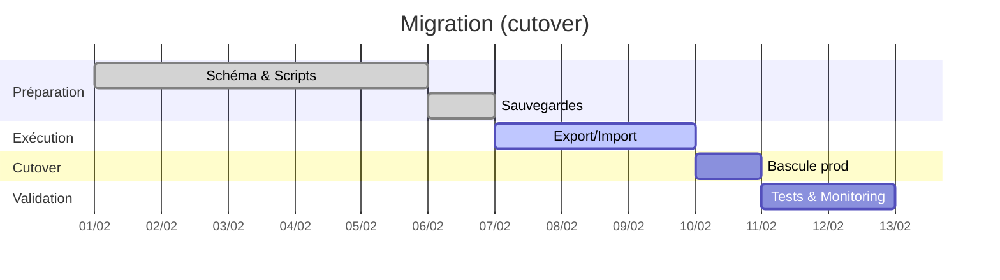

Ce modèle vous permet de créer rapidement des Gantt de planification dans la documentation, sans outil externe.

## Utilisation rapide

- Créez un bloc de code `mermaid` avec le mot-clé `gantt`.
- Définissez `dateFormat` (AAAA-MM-JJ) et éventuellement `axisFormat`.
- Organisez vos tâches par `section`.
- Indiquez l'état (`done`, `active`, ou rien) et des identifiants facultatifs.

Exemple minimal:

## Légende des états

- `done` = terminé (barre remplie)
- `active` = en cours (barre surlignée)
- (vide) = à faire / planifié

---

## Template Sprint (2 semaines)

Astuce: dupliquez ce bloc et ne modifiez que les dates de début.

---

## Template Release (notes + fenêtre de gel)

Checklist release (copier-coller):

- Version: x.y.z — Date: AAAA-MM-JJ
- Nouveautés:
- Corrections:
- Migrations:
- Bugs connus:

---

## Template Migration (cutover)

Checklist migration:

- Variables d'environnement validées
- Scripts d'export/import testés
- Rollback plan documenté
- Monitoring post-cutover actif

---

## Bonnes pratiques

- Gardez les Gantt concis: sections claires, noms courts.
- Mettez à jour régulièrement (dates réalistes, états exacts).
- Liez vos Gantt depuis les pages concernées (Admin, Apps, DevOps).
- Pour des besoins interactifs avancés, préférez un outil externe (Asana/Jira/Notion) et intégrez un lien depuis la doc.
