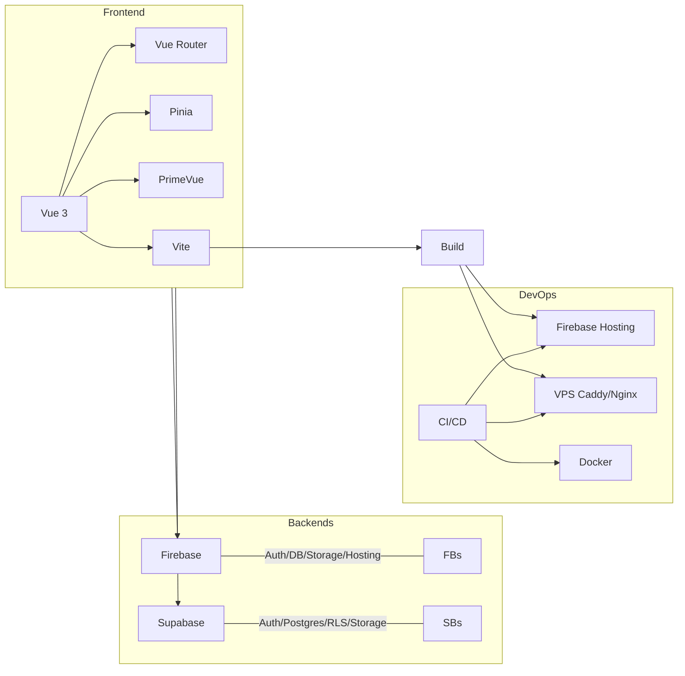

Cette page présente la stack technique complète utilisée par la plateforme HEdS.

## Vue d’ensemble



## Frontend

- Framework: Vue 3 + Vite
- UI: PrimeVue, PrimeFlex, PrimeIcons
- State: Pinia
- Routing: Vue Router
- PWA: vite-plugin-pwa

### Commandes utiles

```bash
# Installer les dépendances
npm install

# Lancer le front
npm run dev

# Lancer les docs
cd documentation && npm install && npm run start
```

## Backends

### Firebase
- Auth, Realtime Database, Storage, Hosting
- Utilisé pour: authentification rapide, données temps réel, hébergement

### Supabase
- Auth, Postgres, Storage, RLS, Realtime
- Utilisé pour: données relationnelles, règles RLS, migrations SQL

## DevOps & Déploiement

- Firebase Hosting (SPA + docs)
- VPS (Caddy/Nginx) pour environnements custom
- Docker (dev/prod) et CI/CD (GitHub Actions)

## Qualité & Contrib

- Lint/Format: ESLint + Prettier
- Conventions: commits, PRs, revues
- Tests: à étendre (unitaires/e2e)

## Références

- Architecture: [/docs/architecture](/docs/architecture)
- Déploiement: [/docs/devops/firebase-hosting](/docs/devops/firebase-hosting)
- Migration: [/docs/data/migration-firebase-supabase](/docs/data/migration-firebase-supabase)
