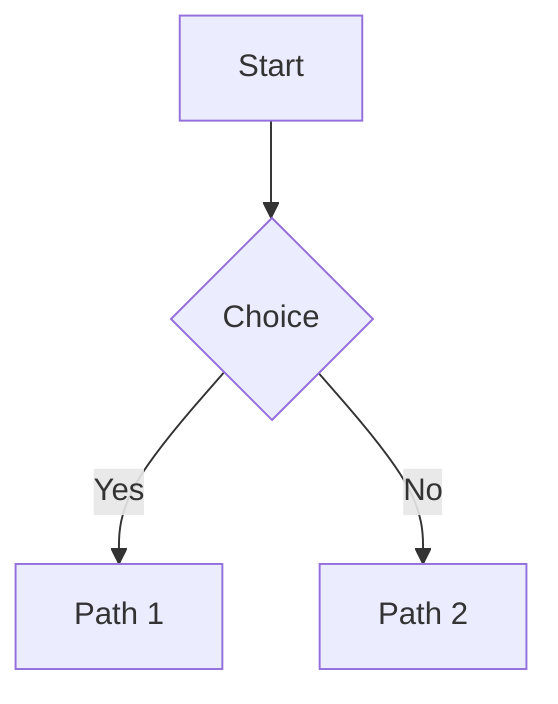

Résoudre les soucis de coloration Prism (blocs de code) et Mermaid dans la doc.

## Symptômes

- Blocs de code sans couleur ou mauvais thème
- Bouton « copy » absent ou style incohérent
- Blocs shell non différenciés vs code (couleur d’accent)
- Diagrammes Mermaid non rendus

## Configuration de référence

- Fichier: `documentation/docusaurus.config.js`
  - `themeConfig.prism.theme = themes.github` (clair)
  - `themeConfig.prism.darkTheme = themes.dracula` (sombre)
  - `markdown.mermaid = true`, `themes: ['@docusaurus/theme-mermaid']`
- Styles: `documentation/src/css/custom.css`
  - Accent or pour `bash/sh/shell/powershell` (bordure gauche)
  - Fond et surfaces alignés avec l’app

## Bonnes pratiques (blocs de code)

- Toujours préciser la langue après les backticks:

```bash
```bash
npm run dev
```
```

```powershell
```powershell
Remove-Item -Recurse -Force node_modules\.vite
```
```

```js
```js
console.log('Hello')
```
```

- Utiliser `bash`/`powershell` pour distinguer les commandes (accent or via CSS)
- Éviter `text`/sans langue si vous voulez la coloration et le style de commande

## Problèmes fréquents et correctifs

- Langage manquant ou erroné → ajouter la bonne langue (ex: `bash`, `js`)
- Thème incorrect → vérifier `themeConfig.prism` dans `docusaurus.config.js`
- Style absent → confirmer l’import `custom.css` dans la preset `classic.theme.customCss`
- Mermaid non rendu → vérifier:
  - `markdown.mermaid = true` et thème mermaid défini dans `themeConfig.mermaid`
  - Fences: utiliser



## Build & Preview

```bash
npm run docs:build
npm run docs:serve
```

- Le build est généré sous `documentation/build/`
- `docs:serve` sert localement le site (port 3000)
